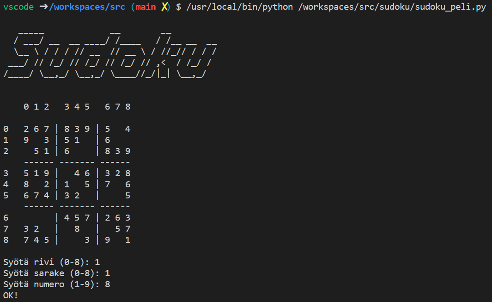

# Tekstikäyttöliittymä sudoku-peliin

Kurssin sudoku-tehtävien myötä saatte itsellenne toimivan sudoku-tarkastuslogiikan, mutta varsinaisen pelattavan pelin kehittäminen ei ole osana harjoitustehtäväpakettia.

Jos haluat, voit hyödyntää oman koodisi kokeilemisessa oheista sudoku-tekstikäyttöliittymää. Kopioi itsellesi [sudoku_peli.py](sudoku_peli.py) sekä [sudoku_tarkistin.py](sudoku_tarkistin.py). Lisää sudoku_tarkistin.py-tiedostoosi oma toteutuksesi `sudoku_oikein`-funktiosta ja sen mahdollisesti tarvitsemista apufunktioista, kuten `rivi_oikein`, `sarake_oikein` ja `nelio_oikein`.

Mukavia pelihetkiä 😄

